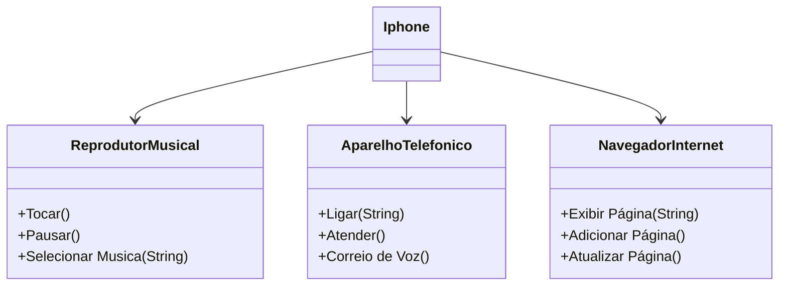

### Segue abaixo o diagama de um iphone
Nos arquivos se encontram também a utilização de cada um

```mermaid

classDiagram

class ReprodutorMusical{    
+Tocar()
+Pausar()
+Selecionar Musica(String)
}

class AparelhoTelefonico{
+Ligar(String)
+Atender()
+Correio de Voz()
}

class NavegadorInternet{
+Exibir Página(String)
+Adicionar Página()
+Atualizar Página()
}

Iphone --> Reprodutor Musical
Iphone --> Aparelho Telefonico
Iphone --> Navegador Internet

```